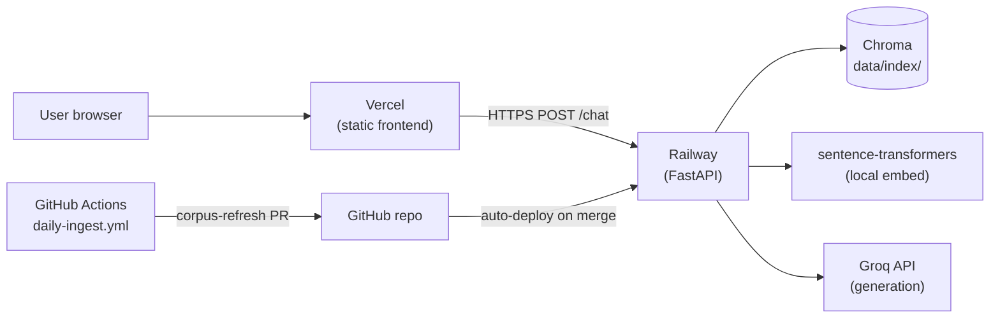

# Deployment Plan — Mutual Fund FAQ Assistant

**Facts-only. No investment advice.**

This document describes how to deploy the project to production using:

| Layer | Platform | What runs there |
| --- | --- | --- |
| **Backend** | [Railway](https://railway.app) | FastAPI chat API, local embeddings (`BAAI/bge-small-en-v1.5`), Chroma vector index |
| **Frontend** | [Vercel](https://vercel.com) | React + Vite static chat UI |
| **Corpus refresh** | GitHub Actions (already configured) | Nightly ingest → review PR → merge triggers Railway redeploy |

The online path never runs ingestion. Railway serves queries only; the corpus is baked into the container image from git (`data/processed/` + `data/index/`).

---

## 1. Architecture



**Request flow**

1. User opens the Vercel-hosted UI.
2. Browser calls `POST https://<railway-host>/chat` (configured via `VITE_API_BASE_URL`).
3. Railway loads the query embedding locally, searches Chroma, calls Groq, validates the answer, returns JSON.
4. UI renders the answer with Groww citation and `Last updated from sources:` footer.

**Corpus update flow**

1. GitHub Actions runs `scripts/ingest.py --full` at 10:00 IST daily.
2. On change, it pushes `corpus-refresh` and opens/updates a pull request.
3. You review the fact table in the PR comment, then merge.
4. Railway redeploys from `main` with the new `data/index/` — no manual ingest on the server.

---

## 2. Prerequisites

Before deploying, confirm:

- [ ] **Groq API key** with access to `openai/gpt-oss-120b` and `openai/gpt-oss-20b`.
- [ ] **Corpus on `main`** — merge the open `corpus-refresh` PR (or run ingest locally and commit `data/processed/` + `data/index/`). Without `data/index/chroma.sqlite3`, `/health` reports `index.ready: false`.
- [ ] **GitHub repo** connected to both Railway and Vercel.
- [ ] **Workflow permissions** enabled: *Settings → Actions → General → Allow GitHub Actions to create and approve pull requests* (required for nightly corpus PRs).

---

## 3. Backend — Railway

### 3.1 Create the service

1. [Railway dashboard](https://railway.app) → **New Project** → **Deploy from GitHub repo**.
2. Select `FallenOne1701/Rag-Mutual-Funds` (or your fork).
3. **Root directory:** repository root (not `frontend/`).
4. **Deployed branch:** `main`. Never point the service at `corpus-refresh` — that branch is rebuilt from `main` by CI and can lag behind the deploy files.
5. Railway finds the root [`Dockerfile`](../Dockerfile) automatically. Confirm the build log shows `Using detected Dockerfile!` — if it shows `using build driver railpack-...` instead, the branch being built has no `Dockerfile` (see §9).

Python 3.11 comes from the image base (`python:3.11-slim`), so `runtime.txt` only matters to the Nixpacks/Railpack fallback path.

### 3.2 Start command

None needed. The Dockerfile's `CMD` runs the app and honours Railway's injected `$PORT`:

```bash
uvicorn main:app --host 0.0.0.0 --port ${PORT:-8000}
```

`main.py` at the repo root re-exports `src.api.main:app` so every builder resolves the same target. [`Procfile`](../Procfile) and [`railpack.json`](../railpack.json) carry the same command as a fallback for Railpack builds.

### 3.3 Build / install

The Docker build runs `pip install -r requirements.txt`. No separate build step is required.

**First deploy is slow** (~2–4 min): `sentence-transformers` downloads `BAAI/bge-small-en-v1.5` (~130 MB) on first query or warmup. Subsequent deploys re-download unless you add a persistent volume for the Hugging Face cache (optional, §8).

### 3.4 Resources

| Setting | Recommendation | Why |
| --- | --- | --- |
| **Memory** | ≥ 2 GB | Chroma + `bge-small-en-v1.5` in RAM |
| **CPU** | 1–2 vCPU | Embedding encode is CPU-bound |
| **Region** | Closest to users (e.g. `asia-southeast1` for India) | Lower latency to Groq + browser |
| **Replicas** | 1 | Chroma is a local SQLite file; multiple replicas would each need their own copy of `data/index/` |

### 3.5 Health check

Configure Railway **health check path:** `/health`

Expected healthy response when fully configured:

```json
{
  "status": "ok",
  "index": { "ready": true, "vectors": 31, "collection": "mf_faq_chunks" },
  "groq": { "configured": true }
}
```

`status: "degraded"` means missing `GROQ_API_KEY` or an empty/missing Chroma index.

### 3.6 Environment variables (Railway)

Set under **Variables** (never commit real values):

| Variable | Required | Example / notes |
| --- | --- | --- |
| `GROQ_API_KEY` | **Yes** | `gsk_...` |
| `API_CORS_ORIGINS` | **Yes** | `https://your-app.vercel.app,https://your-app-*.vercel.app` |
| `GROQ_MODEL` | No | `openai/gpt-oss-120b` (default) |
| `GROQ_MODEL_FAST` | No | `openai/gpt-oss-20b` (default) |
| `GROQ_MAX_TOKENS` | No | `512` |
| `GROQ_TEMPERATURE` | No | `0.1` |
| `GROQ_BUDGET_ENABLED` | No | `true` — keeps free-tier guard on |
| `GROQ_REQUESTS_PER_MINUTE` | No | `30` |
| `GROQ_REQUESTS_PER_DAY` | No | `1000` |
| `GROQ_TOKENS_PER_MINUTE` | No | `8000` |
| `GROQ_TOKENS_PER_DAY` | No | `200000` |
| `CLASSIFIER_GROQ_FALLBACK` | No | `true` |
| `API_RATE_LIMIT_PER_MINUTE` | No | `20` |
| `API_WARMUP_ON_STARTUP` | No | `true` — loads embedder + Chroma at boot (recommended) |

Copy the Railway public URL (e.g. `https://rag-mutual-funds-production.up.railway.app`) — you need it for Vercel.

---

## 4. Frontend — Vercel

### 4.1 Create the project

1. [Vercel dashboard](https://vercel.com) → **Add New → Project** → import the same GitHub repo.
2. **Root Directory:** `frontend` (important — do not deploy from repo root).
3. **Framework Preset:** Vite (auto-detected).
4. **Build Command:** `npm run build`
5. **Output Directory:** `dist`
6. **Install Command:** `npm install`

### 4.2 Environment variables (Vercel)

| Variable | Required | Value |
| --- | --- | --- |
| `VITE_API_BASE_URL` | **Yes** | Full Railway API origin, **no trailing slash** — e.g. `https://rag-mutual-funds-production.up.railway.app` |

> `VITE_*` variables are baked in at **build time**. Changing the Railway URL requires a Vercel redeploy.

### 4.3 CORS wiring

After the first Vercel deploy, copy the production URL (e.g. `https://mf-faq-assistant.vercel.app`) and add it to Railway's `API_CORS_ORIGINS`:

```
https://mf-faq-assistant.vercel.app,https://mf-faq-assistant-*.vercel.app
```

Include preview deployments if you want PR preview frontends to work against production API (or point preview builds at a staging Railway service).

### 4.4 Domains (optional)

- Vercel: add a custom domain under **Project → Settings → Domains**.
- Railway: add a custom domain under **Settings → Networking**.
- Update `API_CORS_ORIGINS` and `VITE_API_BASE_URL` if you use custom domains.

---

## 5. Deploy order

Deploy in this sequence to avoid CORS and missing-index surprises:

```
1. Merge corpus-refresh PR → main has data/index/
2. Deploy Railway backend → verify GET /health
3. Deploy Vercel frontend with VITE_API_BASE_URL = Railway URL
4. Add Vercel URL to Railway API_CORS_ORIGINS → redeploy Railway
5. Smoke-test the live UI
```

---

## 6. Deploy files in the repo

These live at the repo root and make deploys repeatable. All of them are already committed on `main`.

| File | Used by | Purpose |
| --- | --- | --- |
| `Dockerfile` | Railway (auto-detected) | The real build: `python:3.11-slim`, `pip install -r requirements.txt`, `CMD uvicorn main:app` |
| `.dockerignore` | Docker build | Keeps `.venv/`, `data/raw/`, `tests/`, `Docs/`, `frontend/node_modules/` out of the image |
| `main.py` | every builder | Re-exports `src.api.main:app` at the root so `main:app` always resolves |
| `Procfile` | Railpack fallback | `web: uvicorn main:app --host 0.0.0.0 --port ${PORT:-8000}` |
| `railpack.json` | Railpack fallback | Pins the Python provider and the same start command |
| `railway.json` | legacy Railway services only | Builder, start command, health check — **ignored for services in projects created on/after 2026-08-28** (see §9) |
| `runtime.txt` | Railpack/Nixpacks fallback | `python-3.11.9`, matching the GitHub Actions ingest job |

Do not quote the command in `Procfile`. `web: "uvicorn ..."` makes the shell treat the whole quoted string as one program name, and the container exits with "not found".

### `frontend/vercel.json` (optional)

```json
{
  "buildCommand": "npm run build",
  "outputDirectory": "dist",
  "framework": "vite"
}
```

Usually unnecessary if the Vercel UI is configured correctly; useful for documentation-as-code.

### `.railwayignore` (optional)

Exclude dev-only paths from the build context to speed deploys:

```
.venv/
frontend/node_modules/
data/raw/
tests/
Docs/
```

Do **not** ignore `data/index/` or `data/processed/` — the API needs them.

---

## 7. Post-deploy verification

Run these after both services are live.

### Backend (Railway)

```bash
# Replace with your Railway URL
API=https://your-service.up.railway.app

curl -s "$API/health" | jq .
curl -s "$API/schemes" | jq '.schemes | length'   # expect 5

curl -s -X POST "$API/chat" \
  -H "Content-Type: application/json" \
  -d '{"message": "What is the expense ratio of HDFC Large Cap Fund Direct Growth?"}' \
  | jq '{type, answer: .answer[0:120], source: .citation.source_url}'
```

### Frontend (Vercel)

1. Open the Vercel URL.
2. Confirm the disclaimer strip and five schemes load.
3. Ask: *"What is the minimum SIP for HDFC Mid Cap Fund Direct Growth?"*
4. Verify: answer text, Groww link opens, `Last updated from sources:` footer shows a date.
5. Ask: *"Should I invest in HDFC Large Cap?"* → must refuse with educational link.
6. Open browser DevTools → Network → confirm requests go to the Railway host (not `/api` relative path).

### Corpus freshness

1. Merge a `corpus-refresh` PR.
2. Confirm Railway auto-redeployed (check deploy logs).
3. Re-ask a factual question — footer date should match the merged ingest.

---

## 8. Operational notes

### 8.1 Nightly corpus refresh (no Railway action needed)

The [daily-ingest workflow](../.github/workflows/daily-ingest.yml) runs independently:

- **Schedule:** 10:00 IST (`30 4 * * *` UTC)
- **Manual run:** Actions → Daily corpus refresh → Run workflow
- **Output:** PR on `corpus-refresh` with a verification table

Your only job: review and merge when facts change. Railway picks up the new index on the next deploy.

### 8.2 Hugging Face model cache (optional optimization)

By default, each Railway deploy re-downloads the embedding model. To persist the cache across deploys:

1. Add a Railway **Volume** mounted at `/data/hf-cache`.
2. Set `HF_HOME=/data/hf-cache` (or `TRANSFORMERS_CACHE`) in Railway variables.

### 8.3 Groq quota

The API enforces a per-instance Groq budget (`GROQ_BUDGET_ENABLED=true`). Monitor usage via `GET /health` (`groq.requests_today`, `groq.tokens_today`). Over budget → responses fall back to a Groww link.

### 8.4 Rate limiting

`API_RATE_LIMIT_PER_MINUTE` is an in-memory per-IP guard on `/chat`. It resets on redeploy and does not sync across replicas. Fine for a single-replica demo; use Railway's edge rate limiting or Redis if you scale out.

### 8.5 Secrets

| Secret | Where | Never |
| --- | --- | --- |
| `GROQ_API_KEY` | Railway env vars only | Frontend, git, GitHub Actions ingest job |
| `VITE_API_BASE_URL` | Vercel env vars | Not a secret — public in the built JS bundle |

### 8.6 What is **not** deployed

| Component | Stays off the server |
| --- | --- |
| `data/raw/` | Re-fetched only in GitHub Actions |
| Ingest scripts | Run in CI, not on Railway |
| Groq during ingest | Ingestion is LLM-free by design |

---

## 9. Troubleshooting

| Symptom | Likely cause | Fix |
| --- | --- | --- |
| Build fails: `Railpack ... ✖ No start command detected` | Railway built a branch whose root has no `Dockerfile`, `Procfile`, `railpack.json`, or `main.py` — usually the stale `corpus-refresh` branch or a PR environment for it | Deploy `main`; bring `corpus-refresh` up to date with `main` (or merge its PR) before letting Railway build it |
| Build log says `using build driver railpack-...` on `main` | Railway did not see the root `Dockerfile` — wrong root directory, or the file was renamed (detection is case-sensitive) | Set **Root Directory** to `/`; keep the file named exactly `Dockerfile`, or set `RAILWAY_DOCKERFILE_PATH` |
| `railway.json` settings (health check, start command) appear to be ignored | Railway's Config as Code is deprecated: new services cannot use it, and all `railway.json` files stop being read on 2026-12-01 | Set health check path and start command in **service settings**, or migrate with `railway config migrate` to `.railway/railway.ts` |
| Container exits immediately with `not found` | Start command was quoted in `Procfile` or the dashboard | Pass it unquoted: `uvicorn main:app --host 0.0.0.0 --port ${PORT:-8000}` |
| UI: "Can't reach the assistant service" | Wrong `VITE_API_BASE_URL` or Railway down | Check Vercel env, redeploy frontend |
| CORS error in browser console | Vercel origin missing from `API_CORS_ORIGINS` | Add origin to Railway, redeploy |
| `/health` → `index.ready: false` | `data/index/` missing on deployed branch | Merge corpus PR or run ingest locally and push |
| `/health` → `groq.configured: false` | `GROQ_API_KEY` unset or placeholder | Set real key in Railway |
| Slow first response (~30s) | Cold start + model download | Enable `API_WARMUP_ON_STARTUP`; add HF cache volume |
| 429 from API | Per-IP rate limit | Wait 60s; raise `API_RATE_LIMIT_PER_MINUTE` if needed |
| Answers always link to Groww, no text | Groq quota exhausted or key invalid | Check `/health` groq stats; verify key at console.groq.com |
| Footer date stale after merge | Railway did not redeploy | Trigger manual redeploy on Railway |

---

## 10. Cost estimate (demo scale)

| Service | Typical usage | Notes |
| --- | --- | --- |
| **Railway** | ~$5–10/mo (Hobby) | 2 GB RAM service, low traffic |
| **Vercel** | Free (Hobby) | Static site, within bandwidth limits |
| **Groq** | Free tier | Budget guards in app; watch token limits |
| **GitHub Actions** | Free | ~3 min/day for ingest |

---

## 11. Future improvements

When the demo outgrows this setup:

| Need | Direction |
| --- | --- |
| Faster cold starts | Pre-download `BAAI/bge-small-en-v1.5` in the `Dockerfile` so the model ships in the image instead of downloading on first boot |
| Larger corpus / git bloat | Move `data/index/` to S3/R2; download on deploy (implementation-plan Option B) |
| Multiple API replicas | External vector store (e.g. hosted Chroma, Pinecone) + shared index |
| Staging environment | Second Railway service + Vercel preview env with separate `VITE_API_BASE_URL` |
| Custom domain + HTTPS | Both platforms issue certs automatically once DNS is configured |

---

## 12. Quick reference

| What | URL / command |
| --- | --- |
| Local API | `uvicorn src.api.main:app --reload --port 8000` |
| Local UI | `cd frontend && npm run dev` |
| API docs (prod) | `https://<railway-host>/docs` |
| Health check | `https://<railway-host>/health` |
| Manual ingest (local only) | `python scripts/ingest.py --full` |
| Manual workflow run | `gh workflow run "Daily corpus refresh"` |

---

_Facts-only. No investment advice. Sources: groww.in scheme pages._
